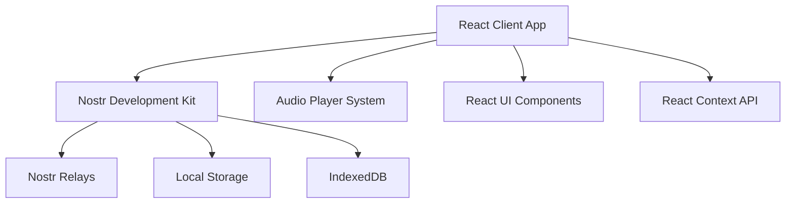
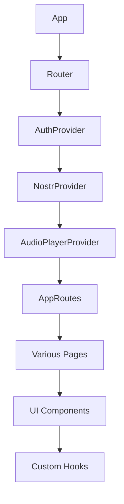

# System Patterns

## Architecture Overview

Runstr utilizes a client-centric architecture with the Nostr protocol as its communication layer:

## Key Technical Decisions

### Decentralization First
- **Protocol-Based**: Built on Nostr as the foundation rather than a centralized API
- **Client-Heavy Logic**: Processing happens primarily on the client to reduce reliance on central servers
- **Local Data Storage**: Preference for local storage with relay synchronization over server-dependent data

### React Component Architecture
- **Component Composition**: Building complex UIs from smaller, reusable components
- **Context API**: Using React Context for state management instead of more complex libraries
- **Lazy Loading**: Implementing code splitting to improve initial load performance

### Authentication
- **NIP-07 Integration**: Using the Nostr browser extension standard for authentication
- **Fallback Authentication**: Supporting alternative authentication methods for users without extensions
- **Public Key Infrastructure**: Utilizing Nostr's cryptographic key system for identity

### Audio Content Management
- **Custom Audio Player**: Built specifically for the needs of the application
- **Progressive Loading**: Loading audio in chunks to improve playback startup time
- **Background Processing**: Handling audio decoding off the main thread where possible

## Design Patterns

### Frontend Patterns
- **Provider Pattern**: Context providers that wrap the application to provide shared state
- **Container/Presentation Pattern**: Separating data handling from UI rendering
- **Custom Hook Pattern**: Encapsulating complex logic in reusable React hooks
- **Error Boundary Pattern**: Catching and handling errors gracefully

### Data Management Patterns
- **Repository Pattern**: Abstract data access behind consistent interfaces
- **Caching Pattern**: Storing frequently accessed data to improve performance
- **Event-Driven Updates**: Using Nostr's event model for real-time data updates

### State Management
- **Context + Reducer Pattern**: Using React Context with reducers for predictable state changes
- **State Lifting**: Moving shared state up the component tree when needed
- **Derived State**: Computing values from state rather than storing redundant data

## Component Relationships

## File Organization

- **Feature-Based Structure**: Organizing code by feature rather than type
- **Shared Utilities**: Common functions extracted to utility modules
- **Context Separation**: Each context provider in its own module
- **Component Co-location**: Keeping related files (components, tests, styles) together

## Testing Strategy

- **Component Testing**: Testing components in isolation
- **Integration Testing**: Testing component interactions
- **Mock Services**: Using mock implementations of Nostr services for testing
- **Performance Testing**: Monitoring and testing for performance regressions

## Future Architectural Considerations

- **Server-Side Rendering**: Potential addition for improved initial load performance
- **Web Worker Offloading**: Moving more processing to web workers
- **PWA Capabilities**: Enhancing offline functionality
- **Protocol Enhancements**: Adapting to new Nostr Improvement Proposals (NIPs) 